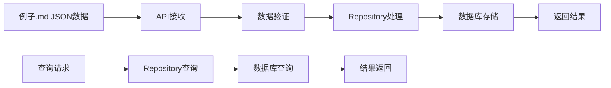

# 小红书痛点分析系统使用说明

## 📋 概述

本系统为小红书痛点分析数据提供完整的存储和查询解决方案，能够处理例子.md中的JSON格式数据，并将其规范化存储到MySQL数据库中。

## 🗃️ 数据库表结构

系统包含以下9个核心数据表：

### 主表
- `xiaohongshu_pain_analysis` - 痛点分析主表，存储内容基本信息和核心分析结果

### 子表
- `xiaohongshu_pain_points` - 痛点详情表
- `xiaohongshu_solved_problems` - 解决方案表
- `xiaohongshu_user_needs` - 用户需求表  
- `xiaohongshu_usage_scenarios` - 使用场景表
- `xiaohongshu_brand_mentions` - 品牌提及表
- `xiaohongshu_product_models` - 产品型号表
- `xiaohongshu_emotional_keywords` - 情感关键词表
- `xiaohongshu_post_tags` - 帖子标签表

## ✅ 智能数据处理

**数据兼容性说明**：系统采用智能数据处理策略：
- **API接收**：完全兼容包含 `frequency` 和 `pain_intensity` 字段的JSON数据
- **数据存储**：严格按照设计文档，只存储核心的 `scenario` 字段到数据库
- **处理方式**：额外字段在存储时会被自动忽略，不会报错

使用场景数据处理：
- `scenario` - 使用场景名称（存储到数据库）
- `frequency` - 使用频次（接受但不存储）
- `pain_intensity` - 痛点强度（接受但不存储）

## 🔧 系统架构

```
sandbox-server/
├── src/
│   ├── models/
│   │   └── pain_analysis_models.py          # 数据模型定义
│   ├── xiaohongshuDataStorage/
│   │   └── pain_analysis_repository.py      # 数据库操作层
│   ├── api/
│   │   └── pain_analysis_routes.py          # API路由
│   └── app.py                               # 主应用（已更新）
├── sql/
│   └── pain_analysis_tables.sql             # 表结构SQL
├── examples/
│   └── pain_analysis_api_example.py         # API调用示例
└── docs/
    └── pain_analysis_usage.md               # 使用说明
```

## 🚀 API接口

### 基础URL
```
http://localhost:8000/api/pain-analysis
```

### 主要端点

#### 1. 存储痛点分析数据
```http
POST /api/pain-analysis/store
Content-Type: application/json

{
  "pain_point_analysis": [...],  // 例子.md中的JSON格式
  "summary_insights": {...},     // 可选
  "analysis_batch": "batch_001"  // 可选，系统自动生成
}
```

#### 2. 获取统计信息
```http
GET /api/pain-analysis/stats?analysis_batch=batch_001
```

#### 3. 查询分析数据
```http
GET /api/pain-analysis/query?content_type=post&sentiment=正面&limit=10
```

#### 4. 获取批次列表
```http
GET /api/pain-analysis/batches
```

#### 5. 获取内容详情
```http
GET /api/pain-analysis/content/{content_id}
```

#### 6. 健康检查
```http
GET /api/pain-analysis/health
```

## 📝 使用示例

### Python客户端调用
```python
import requests

# 存储数据
response = requests.post(
    'http://localhost:8000/api/pain-analysis/store',
    json={
        "pain_point_analysis": [
            {
                "content_id": "67d668d7000000001d01a077",
                "content_type": "post", 
                "user_name": "可爱小鱼鱼.",
                "content_snippet": "巨软糯！巨舒服！...",
                "identified_pain_points": [
                    {
                        "pain_point": "贴身衣物选择困难",
                        "category": "服务",
                        "severity": "中等", 
                        "evidence": "尤其这种贴身衣物 更是要谨慎"
                    }
                ],
                "emotional_analysis": {
                    "overall_sentiment": "正面",
                    "intensity_score": 0.95,
                    "emotional_keywords": ["超爱", "神仙内裤", "太舒服", "安心"],
                    "user_satisfaction": "非常满意"
                },
                # ... 其他字段
            }
        ]
    }
)

result = response.json()
print(f"存储结果: {result['success']}")
print(f"批次ID: {result['analysis_batch']}")
```

### cURL调用示例
```bash
# 健康检查
curl -X GET http://localhost:8000/api/pain-analysis/health

# 获取统计信息
curl -X GET "http://localhost:8000/api/pain-analysis/stats?analysis_batch=batch_001"

# 查询数据
curl -X GET "http://localhost:8000/api/pain-analysis/query?content_type=post&limit=5"
```

## 🏃‍♂️ 快速开始

### 1. 启动服务
```bash
cd sandbox-server/src
python app.py
```
服务将在 `http://localhost:8000` 启动

### 2. 检查服务状态
访问: http://localhost:8000/api/pain-analysis/health

### 3. 运行示例代码
```bash
cd sandbox-server
python examples/pain_analysis_api_example.py
```

## 📊 数据流程



## 🔍 数据验证

系统使用Pydantic进行严格的数据验证，确保：

- ✅ 所有必填字段完整
- ✅ 枚举值符合预定义范围
- ✅ 数据类型正确
- ✅ 数值范围有效（如intensity_score: 0.0-1.0）

## 📈 性能特性

- **事务支持**: 使用数据库事务确保数据一致性
- **批量插入**: 支持高效的批量数据存储
- **索引优化**: 主要查询字段都有索引支持
- **连接池**: 支持数据库连接池提升并发性能
- **错误恢复**: 完善的错误处理和回滚机制

## 🚨 注意事项

1. **字段映射**: 确保JSON中的字段名与数据模型一致
2. **枚举值**: 严格按照定义的枚举值传入数据
3. **外键约束**: content_id必须在主表中存在
4. **字符编码**: 所有文本使用UTF-8编码
5. **数据大小**: 单次请求建议不超过1000条记录

## 🐛 故障排除

### 常见问题

1. **表不存在错误**
   - 执行 `sandbox-server/sql/pain_analysis_tables.sql` 创建表

2. **字段缺失错误**
   - 检查是否执行了修复SQL语句

3. **枚举值错误**
   - 确认传入的枚举值与表定义一致

4. **外键约束错误**
   - 确保content_id在主表中存在

### 调试技巧

1. 使用健康检查端点验证系统状态
2. 查看API返回的详细错误信息
3. 检查服务器日志获取详细异常信息

## 📚 扩展功能

系统预留了扩展接口，可以轻松添加：

- 批量删除功能
- 数据导出功能
- 高级统计分析
- 数据可视化接口
- 定时任务处理

## 🎯 总结

该系统完全适配例子.md中的JSON输出格式，提供了：
- ✅ 完整的数据存储解决方案
- ✅ 灵活的查询接口
- ✅ 完善的错误处理
- ✅ 详细的使用文档
- ✅ 可扩展的架构设计

现在你可以直接使用API接口来存储和查询小红书痛点分析数据了！
